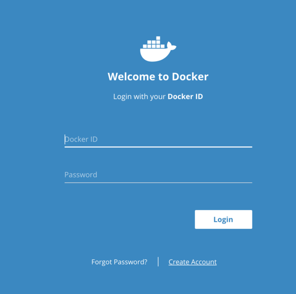
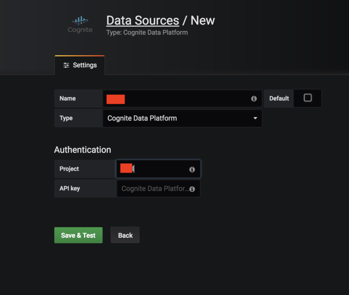
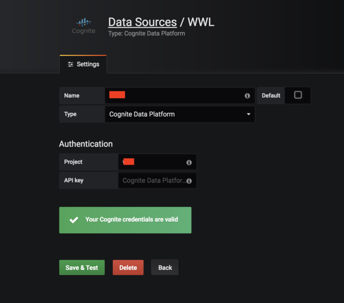
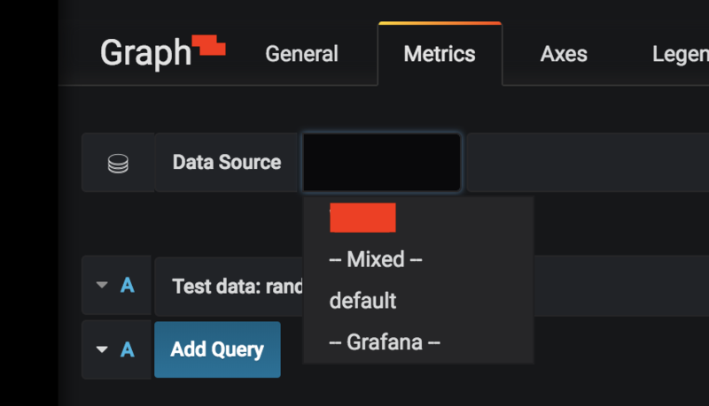
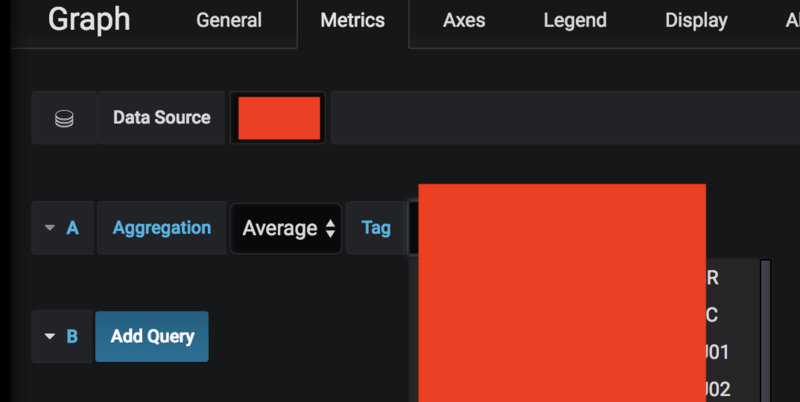
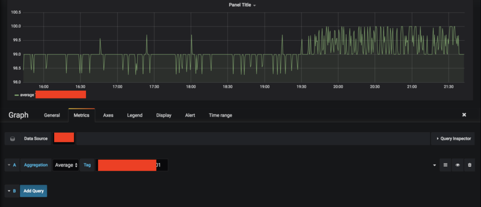

# Step-by-step guide to how to get started with Grafana

1. Use the virtual machine Docker to access the Grafana data source for Cognite Data Fusion. Download it here: https://www.docker.com/get-started

Create an account and log in to download. Use whatever email that you prefer.

After download, log in to launch Docker.

2. Use terminal to first create a Docker volume (as in the GitHub instructions). Use the command:

   docker volume create grafana-storage

3. Run Docker using the volume just created

   docker run -d --name grafana -p 3000:3000 -v grafana-storage:/var/lib/grafana cognite/grafana-cdf

The download from cognite/grafana-cdf will start immediately.

4. Now you can access Grafana at http://localhost:3000

Standard username/password for logging in is admin/admin.

Once logged in you can see that CDF is installed.

5. To set up CDF, do the following:

Go to "Configuration" click Data Sources, then Add data source, and choose Cognite Data Fusion as "Type". Give the data source a name, provide the name of the project and your API key.

You're ready to make your first chart!

6. To make a chart, click on Dashboard, and choose Graph under "Add". Click on "Panel Title" and choose Edit.

Under "Metric", choose your data source and aggregation, and start typing the name of your tag. Suggestions will appear.

**Voilà!**

